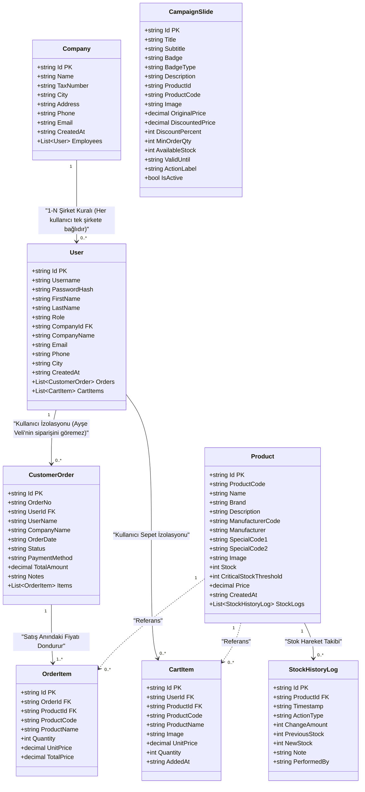
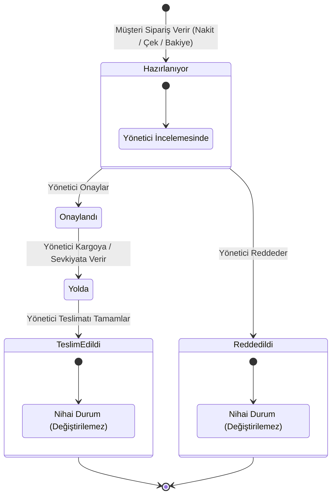
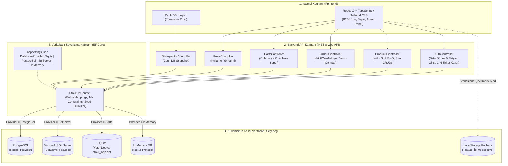
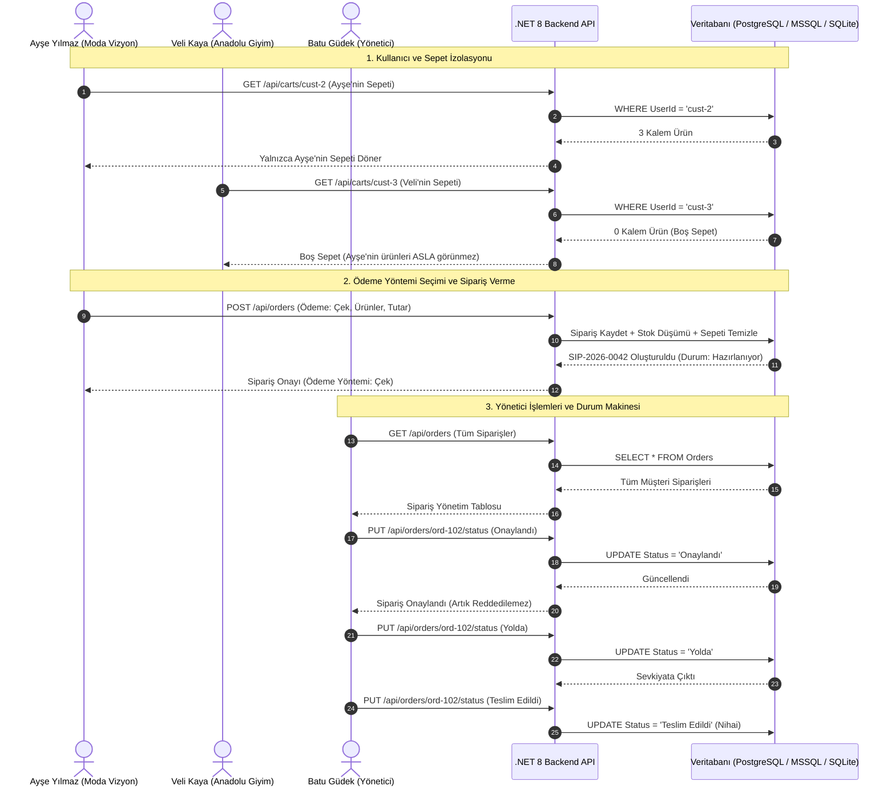

# Stokk B2B & E-Ticaret Portalı - UML ve Sistem Çalışma Diyagramları

Bu dokümanda, Stokk platformunun veritabanı varlık ilişkileri (**UML Sınıf Diyagramı**), sipariş yaşam döngüsü (**Durum Makinesi Diyagramı**) ve çoklu veritabanı mimarisi (**Sistem Çalışma Akış Diyagramı**) Mermaid formatında detaylandırılmıştır.

---

## 1. UML Sınıf Diyagramı (Class Diagram)

Aşağıdaki diyagramda tüm varlıkların alanları, veri tipleri ve aralarındaki 1-N ilişkileri (özellikle Şirket - Çalışan 1-N kuralı ve Kullanıcı - Sipariş/Sepet mikroservis izolasyonları) gösterilmiştir:

---

## 2. Sipariş Durum Otomatı (State Machine Diagram)

Siparişler yönetici tarafından yönetilir ve durum geçişleri aşağıdaki kesin iş kurallarına tabidir:
1. Sipariş verildiğinde durumu **"Hazırlanıyor"** olarak başlar.
2. Yönetici siparişi **"Onaylandı"** veya **"Reddedildi"** yapabilir.
3. Onaylanan sipariş artık **reddedilemez**, yalnızca **"Yolda"** durumuna geçirilebilir.
4. Yoldaki sipariş yalnızca **"Teslim Edildi"** durumuna geçirilebilir.
5. **"Teslim Edildi"** ve **"Reddedildi"** nihai (terminal) durumlardır; durumları asla değiştirilemez.

---

## 3. Sistem Çalışma Akış ve Çoklu Veritabanı Mimarisi (Architecture Flow)

Kullanıcıların **kendi veritabanlarını (PostgreSQL, SQL Server, MySQL, SQLite)** tek bir ayar ile bağlayabilmesini sağlayan mimari:

---

## 4. Kullanıcı İzolasyonu ve 1-N Şirket Kuralı Akışı

